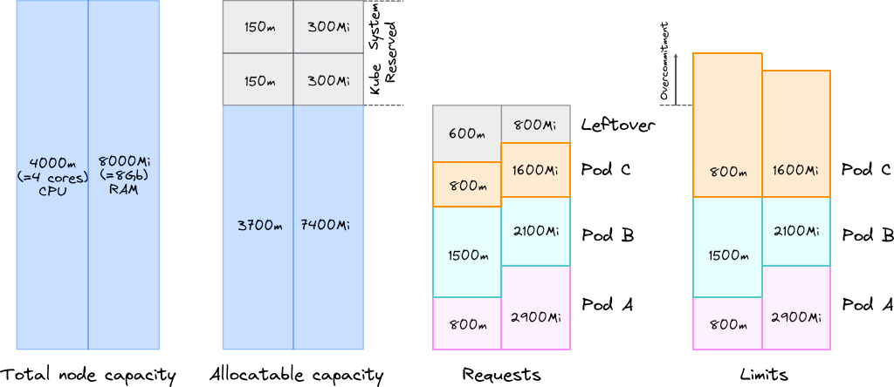
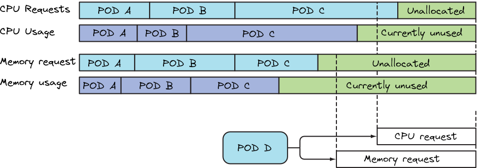
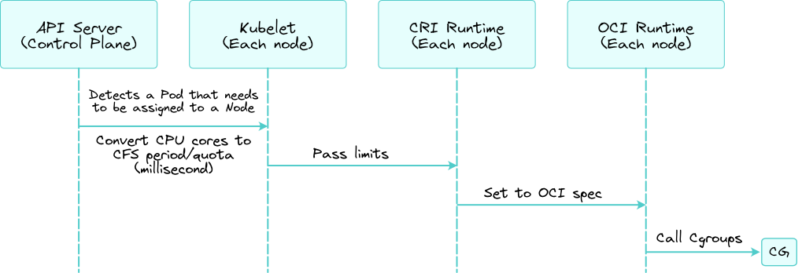

Setting both how much a pod is expected to consume and the maximum amount it's allowed to consume is vital part of any pod definition. Setting these two parameters makes sure that a pod takes only its fair share of the resources provided by the Kubernetes cluster and also affects how pods are scheduled across the cluster. 

:::info This post covers
+ Requesting CPU, memory, and other computational resources for containers
+ Setting a hard limit for CPU and memory
+ Understanding Quality of Service guarantees for pods
+ Setting default, min, and max resources for pods in a namespace
+ Limiting the total amount of resources available in a namespace
:::

## Request resources for a pod's containers

When we create a pod, we can optionally specify how much resources a container needs  (known as __requests__) and a hard limit on what it may consume (known as __limits__). 
Kubernetes has support for many different types of resources including CPU, memory, storage, network bandwidth, and the use of special devices such as graphical processing units (aka GPUs). We'll focus on the most commonly specified resources types: CPU and memory.
### Creating a pod with resource requests and limits
We will start our journey with an ordinary pod manifest spec:

```yaml
---
apiVersion: v1
kind: Pod
metadata:
  name: requests-pod
spec:
  containers:
  - image: busybox
    command: ["dd", "if=/dev/zero", "of=/dev/null"]
    name: main
    resources:
      requests:
        cpu: 200m
        memory: 10Mi
      limits:
        memory: 10Mi
```


The pod manifest specification is simple, it only has one container executing the command:

```bash
$ dd if=/dev/zero of=/dev/null
```

Our humble container requires one-fifth of a CPU core to run properly and also 10 mebibytes of memory.
## Requests for planning

First let's see how `requests` are used for scheduling workloads to nodes, later we will see that we can constrain our container on what it may consume, that is, setting a hard limit known as `limits`. By specifying resource requests we are telling to Kubernetes the minimum amount of resources our pod needs. Resource requests are used by the Scheduler to assign a node to a pod. Each node has a certain amount of CPU and memory to allocate pods on nodes. By default Pods can consume all the available capacity on a node by default. This can be an issue because nodes typically run quite a few system daemon that power the OS and Kubernetes itself. So it is the job of kubernetes administrator to set aside resources for these system daemons configuring `Node Allocatable` based on the workload density on each node in the cluster.



:::info

Kubelet reports the resources that each node has to the API server which are available to the scheduler through the Node resource. We can see that by using the `kubectl describe` command.

```bash
$ kubectl describe nodes
Name:               lbmwk1
...
Capacity:
  cpu:                4
  ephemeral-storage:  61275608Ki
  hugepages-1Gi:      0
  hugepages-2Mi:      0
  hugepages-32Mi:     0
  hugepages-64Ki:     0
  memory:             3880868Ki
  pods:               110
Allocatable:
  cpu:                4
  ephemeral-storage:  59608911416
  hugepages-1Gi:      0
  hugepages-2Mi:      0
  hugepages-32Mi:     0
  hugepages-64Ki:     0
  memory:             3880868Ki
  pods:               110
...
```

The output shows two sets of amounts related to the available resources on the node:
the node’s capacity and allocatable resources. The capacity represents the total resources
of a node, which may not all be available to pods. Certain resources may be reserved
for Kubernetes and/or system components. The Scheduler bases its decisions only on
the allocatable resource amounts.
:::

When assigning a pod the scheduler will only consider nodes with enough unallocated resources to meet the pod’s resources requirements. The scheduler does not care about the resources that are being used at the exact time of scheduling but instead the sum of resources requested by the existing pods deployed on the node. Note that scheduling another pod based on actual resource usage would break the guarantee given to the already deployed pods. 



Let's do an example to visualize all of the above. Let's imagine that there are three pods (_PODs A_, _B_ and _C_) deployed on a node which they've requested 80% of the node's CPU and 60% of the node's memory. Pod D, shown at the bottom right of the figure, cannot be scheduled onto the node because the unallocated CPU is roughly a 20% and the pod requests is 25% which is more. Note that the three pods are using 70% of the CPU and this makes no differentece.


### Journey of a requests

### CPU requests affect CPU time sharing

The CPU requests are generally fulfilled at the Kubernetes scheduler level but they also determine how the remaining unused CPU time is distributed between pods as we will see later in more detail.

## QoS class in kubernetes

In addition to provide resource isolation, resource request and limits determine the pod QoS class. That is, every pod has a QoS class based on the request and limit values that we set. There are three types which are summarized in the following table

| **QoS Class** 	| **Condition**                                                                                                                           	| **Priority (Lower is better)** 	|
|---------------	|-----------------------------------------------------------------------------------------------------------------------------------------	|--------------------------------	|
| Guaranteed    	| Limits and optionally requests (not equal to 0) are set for all resources across all containers and they are equal                      	| 1                              	|
| Burstable     	| Requests and optionally limits are set (not equal to 0) for one or more resources across one or more containers, and they are not equal 	| 2                              	|
| BestEffort    	| Requests and limits are not set for all of the resources, across all containers                                                         	| 3                              	|


## Limits by level

Now we are going to talk about limits. The main thing to know about limits is that limits are for enforcing the rules. This way we say this pod can't go over this limit of resources. Let's take a look of what happens when a limit comes in to Kubernetes. 

### The Journey of a Pod Limit

Let's see how resource limit value is being used in Kubernetes. Once pod spec is registered to Kubernetes, kube scheduler fetches the new pod specs and then assigns a node to the Pod you want to create, but the limit value is not directly used at this moment yet. Kubelet on each node, runs the sync process to fetch the latest information of the Pod that are assigned. Kubelet, sees the limit value from pods spec then converts the CPU cores value to CFS period and quota milliseconds. Then kubelet calls container runtime interface to create actual containers on the Linux host. 



Once container runtimes get the entry from Kubelet it executes the container creation by calling cgroup's. Now let's deep dive into the three parts here: cgroup's, CFS period and quota and container runtimes.


## Container primitives

When we talk about containers, it is actually implemented with Linux kernel features that is called cgroup's and namespaces: __namespaces__ are used to isolate process on Linux hosts and __cgroups__ is used to limit resources. This time we talk about resource managemement in Kubernetes so we are not going to talk about namespaces.


### Control groups or cgroup's


Control groups often referred as cgroups is a mechanism to limit the resources,
such as memory, CPU, and network input/ouput that a group of processes can use. Kubelet and the underlying container runtime need to interface with cgroups to enforce resource management for pods and containers which includes cpu/memory requests and limits for containerized workloads. Note that this is needed to prevent starvation from one pod to another. (IMPROVE)

:::info
When we refer to control groups, we refer tp the unified version or simply version 2. The cgroup version depends on the Linux distribution and the default cgroup version configured on the OS. To check which cgroup version our distribution uses, we can run 
```bash 
stat -fc %T /sys/fs/cgroup/
``` 
the output for version will be `cgroup2fs` and for version 1 will be `tmpfs`.
:::

The CPU request value that we set in Kubernetes will be converted to CPU weight in cgroup world and the CPU limit will be converted from CPU core numbers to the CPU time value of CFS and stored in cgroups as CFS period and quota. 

:::info

+ __CPU Requests__ in K8s will map to `cpu.shares` in cgroups
+ __CPU Limits__ in K8s will map to `cpu.cfs_period_us` and `cpu.cfs_quota_us` in cgroups. Note that us stands for microseconds.
+ __Memory Limits__ in K8s will map to `memory.limit_in_bytes`
+ __Memory Requests__ ...

:::

Those cgroup values can be seen for our running pods on each node by seeing files under `/sys/fs/cgroup` s' directory. 

:::info
The development of the Linux cgroup subsystem started in 2006 at Google, led primarly by Rohit Seth and Paul Menage. The cgroup functionality was merged into the Linux kernel mainline in kernel version 2.6.24, which was released in January 2008. Afterwards this is called cgroups version 1. 
:::

:::info
The development and maintenance of cgroups was then taken by Tejun Heo who redesigned and rewrote cgroups. This rewrite is now called version 2.
:::

:::info
Cgroup v2 focuses on simplicity: `/sys/fs/cgroup/x/foo` (x is the controller for example cpu or memory) in v1 are now unified as `/sys/fs/cgroup/foo` , and a process can no longer join different groups for different controllers. If the process joins foo ( `/sys/fs/cgroup/foo` ), all controllers enabled for `foo` will take the control of the process.


:::


## CFS Quota? Period?

+ CFS = "Completely Fair" Scheduler A process scheduler in Linux
+ Container isolation is based on cgroups (a Linux kernel functionality) resource limitation
+ Cgroups uses CFS to implement CPU resource restriction
+ CFS scheduling is based on processing time but not core. 
+ Scheduling period is every 100ms

## CRI Runtime vs OCI Runtime

How container runtime works on Kubernetes


https://medium.com/nttlabs/cgroup-v2-596d035be4d7
https://access.redhat.com/documentation/en-us/red_hat_enterprise_linux/8/html/managing_monitoring_and_updating_the_kernel/using-cgroups-v2-to-control-distribution-of-cpu-time-for-applications_managing-monitoring-and-updating-the-kernel#doc-wrapper