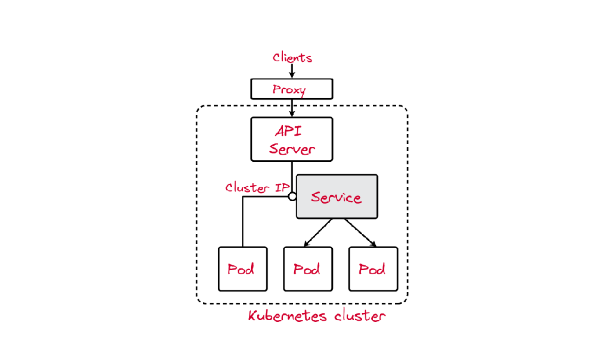

Supongamos el siguiente escenario, tengo un pod cliente que quiere hablar con uno de mis pods corriendo en el cluster. En este caso mi pod es un sitio web, además supongamos que por el alto volumen de tráfico tenemos varias replicas. ¿Cómo sabe el pod cliente como conectarse a uno de mis pods?

Sabemos que los pods pueden comunicarse entre ellos usando sus direcciones IP pero de nuevo, ¿cómo sabe el pod cliente como encontrarla y cuál usar?


Asumamos por un momento que tenemos algún mecánismo de resolución de nombres y obtenemos un pod al que conectarnos pero ¿que sucede si el pod escogido al azar se cae y perdemos la conexión? Es solo cuestión de tiempo que alguna mierda pase. El cliente tiene que conectarse de nuevo a otro pod. Esto parece senzillo pero no lo es especialmente en el contexto de Kubernetes en el que se generan y destruyen pods de manera constante. Las IPs de los pods son efimeras y los clientes no pueden "fiarse" de ellas. 

Vemos de manera lógica que necesitamos de algo intermedio entre nuestro pod cliente y los pods. Este algo que buscamos es el objeto `Service`.

## ¿Qué es un servicio?

Para dar solución a la problemática planteada se ha creado el objeto `Service`. El `Service` es la pieza utilizada como único punto de acceso hacia un grupo de Pods. Sus principales características son:


+ Constituye una IP Virtual estable y una dirección de dominio para acceder a un grupo de Pods.
+ La forma de asociar Pods a un `Service` es a través de las etiquetas.
+ Las direcciones IP de los Pods constituyen el listado de Endpoints. Un Endpoint es una IP
+ Puerto y protocolo asociada a la IP virtual.
+ Se utiliza para la parte de autodescubrimiento mediante el DNS interno del cluster.


([Services](https://kubernetes.io/docs/concepts/services-networking/service/))

El componente `kube-proxy`siempre está al tanto de los cambios realizados sobre los objetos de tipo `Service`. Para cada `Service`, `kube-proxy` configura nuevas relgas en el registro de IPs del nodo para capturar el tráfico y luego dirigirlo hacia un Pod. 

Existe un Pod `kube-proxy` corriendo en cada nodo del cluster para llevar a cabo esta tarea.

## Tipos de Services
La forma de poder a las aplicaciones puede ser

+ Desde dentro del cluster
+ Desde fuera del cluster

veamos los diferentes tipos de servicios disponibles en Kubernetes

### ClusterIP

Solo se permite el acceso interno a un Service de este tipo. Es decir, si tenemos un despliegue con una aplicación a la que no es necesario acceder desde el exterior, crearemos un Service de este tipo para que otras aplicaciones puedan acceder a ella (por ejemplo, una base de datos). Es el tipo por defecto. Si deseamos seguir accediendo desde el exterior, para hacer pruebas durante la fase de desarrollo podemos seguir utilizando la instrucción `kubectl port-forward`.





### NodePort

Abre un puerto, para que el `Service` sea accesible desde el exterior. Por defecto el puerto generado está en el rango de 30000:40000. Para acceder usamos la ip del servidor master del cluster y el puerto asignado.


### LoadBalancer

Este tipo sólo está soportado en servicios de cloud público (GKE, AKS o AWS). El proveedor asignará un recurso de balanceo de carga para el acceso a los Services. Si usamos un cloud privado como OpenStack, necesitaremos un plugin para configurar el funcionamiento. Este tipo de Service no lo vamos a utilizar en el presente curso.

En este sección vamos a ver los siguientes puntos:

+ Cómo crear un servicio de tipo ClusterIP y NodePort
+ Como listar servicios y obtener información acerca de los mismos


## Crear un servicio tipo ClusterIP

Lo primero que vamos a hacer es deplegar un deployment de nginx usando el fichero yaml: [`nginx-deployment.yaml`](./07/files/nginx-deployment.yaml):

```  
kubectl apply -f nginx-deployment.yaml
```

Por lo tanto tenemos dos Pods ofreciendo el servidor web nginx, a los que queremos acceder y poder balancear la carga. 

```bash
$ kubectl get deployments                   
NAME    READY   UP-TO-DATE   AVAILABLE   AGE
nginx   2/2     2
```

Como sabemos podemos crear objetos en kubernetes de manera imperativa o declarativa. Usando el comando `create service` generamos un nuevo objeto en el cluster de tipo `Service`. Cuando usamos este comando es importante indicar el tipo de servicio que queremos usar y opcionalmente el mapeo de puertos. Por ahora no nos preocupamos del mapeo de puertos lo veremos más adelante.

```bash
$ kubectl create service clusterip nginx-service --tcp=80:80
```

En lugar de crear el servicio como un objeto independiente, podemos exponer el pod o el deployment con un único comando. El comando `run` proporciona la opción `--expose` el cuál nos permite crear un pod y su correspondiente `Service` con las etiquetas correctamente configuradas para balancear el tráfico 

```bash
$ kubectl run nginx --image=nginx --restart=Never --port=80 --target-port=80
```


Para un deployment que ya tenemos corriendo en el cluster podemos usar el comando `expose deployment` para exponer los pods que hay por debajo de ese deployment de la siguiente manera:

```bash
$ kubectl expose deployment/nginx --port=80 --type=ClusterIP
```

En general lo que hacemos es usar el modelo declarativo y describir las características del Service en un fichero yaml [`nginx-srv.yaml`](files/nginx-srv.yaml):

```yaml
apiVersion: v1
kind: Service
metadata:
  name: nginx
spec:
  type: ClusterIP
  ports:
  - name: service-http
    port: 80
    targetPort: http
  selector:
    app: nginx
```

Vamos a describir lo que hemos hecho:

* Hemos creado un recurso de tipo `Service` (parámetro `kind`) y lo nombramos como `nginx` (parámetro `name`). Este nombre será importante para la resolución dns.
* En la especificación del recurso indicamos un servicio de tipo `ClusterIP` (parámetro `type`).
* A continuación, definimos el puerto por el que va a ofrecer el Service y lo nombramos (dentro del apartado `port`: el parámetro `port` y el parámetro `name`). Además, debemos indicar el puerto en el que los Pods están ofreciendo el Service (parámetro `targetPort`), en este caso, hemos usado el nombre del puerto (`http`) que indicamos en el recurso Deployment:

  ```yaml
     ...
     ports:
      - name: http
        containerPort: 80
     ...
  ```
* Por ultimo, seleccionamos los Pods a los que vamos acceder y vamos a balancear la carga seleccionando los Pods por medio de sus etiquetas (parámetro `selector`).

Utilizamos el comando `apply` para poner en funcionamiento el ejemplo anterior

```bash
$ kubectl apply -f nginx-clusterip.yaml
```

### Examinando los servicios creados

#### Listar Servicios

Podemos listar los servicios que tenemos con el siguiente comando:

```bash
$ kubectl get services                        
NAME         TYPE        CLUSTER-IP   EXTERNAL-IP   PORT(S)   AGE
nginx        ClusterIP   10.43.1.37   <none>        80/TCP    3m36s 
```

La salida del comando nos indica el tipo de servicio, la IP virtual asociada y los puertos mapeados. 

:::info Recordar
La IP asociada a un servicio de tipo `ClusterIP` es solamente accesible desde dentro del cluster.
:::

#### Obtener información detallada del servicio

El comando `describe` nos permite obtener más información del servicio creado.

```bash
$ kubectl describe svc nginx                   
Name:              nginx
Namespace:         default
Labels:            app=nginx
Annotations:       <none>
Selector:          app=nginx
Type:              ClusterIP
IP Family Policy:  SingleStack
IP Families:       IPv4
IP:                10.43.1.37
IPs:               10.43.1.37
Port:              <unset>  80/TCP
TargetPort:        80/TCP
Endpoints:         10.42.0.6:80,10.42.2.6:80
Session Affinity:  None
Events:            <none>
```


#### Acceder al servicio creado

Existen varias formas de comprobar si el servicio está dirigiendo el tráfico correctamente hacia los Pods. EN esta ocasión se utilizará el comando Port-forward, que permitirá enviar el tráfico desde el puerto de la máquina local hacia el servicio expuesto por la aplicación. 

```
$ kubectl get svc
NAME         TYPE        CLUSTER-IP     EXTERNAL-IP   PORT(S)   AGE
...
nginx        ClusterIP   10.96.152.46   <none>        80/TCP    10m
$ kubectl port-forward svc/nginx 8080:80
Forwarding from 127.0.0.1:8080 -> 80
Forwarding from [::1]:8080 -> 80
```

Una vez iniciado el comando podemos abrir el navegador web y acceder a [](http://localhost:8080) también podriamos usar el comando curl y obtendriamos el mismo resultado. 

Recordar que el servicio de tipo `ClusterIP` solamente es accesible desde dentro del cluster. Para demostrar vamos a poner a correr un pod con la imagen de busybox y ejecutaremos wget para testear el acceso a la aplicación.

```
$ kubectl run busybox --image=busybox --restart=Never -it -- /bin/sh
If you don't see a command prompt, try pressing enter.
/ # wget -O- 10.96.152.46:80
Connecting to 10.96.152.46:80 (10.96.152.46:80)
writing to stdout
<!DOCTYPE html>
<html>
<head>
<title>Welcome to nginx!</title>
<style>
    body {
        width: 35em;
        margin: 0 auto;
        font-family: Tahoma, Verdana, Arial, sans-serif;
    }
</style>
</head>
<body>
<h1>Welcome to nginx!</h1>
<p>If you see this page, the nginx web server is successfully installed and
working. Further configuration is required.</p>

<p>For online documentation and support please refer to
<a href="http://nginx.org/">nginx.org</a>.<br/>
Commercial support is available at
<a href="http://nginx.com/">nginx.com</a>.</p>

<p><em>Thank you for using nginx.</em></p>
</body>
</html>
-                    100% |*******************************************************************************************************|   612  0:00:00 ETA 
written to stdout
/ #
```

### ¿Qué es lo que realmente esta sucediendo?


En los nodos dónde se ejecutan los pods corre un proxy el cuál intercepta el tráfico, por defecto este componente es conocido como "kube-proxy". En realidad este componente no es un proxy en si mismo sino que convierte a los nodos en un proxy. Para conseguir que los nodos funcionen como un proxy se usan funcionalidades del kernel de linux como IPTables o IPVS segun el modo en que este funcionando y esto depende de cómo se haya instalado o de la distribución usada de k8s.


El cliente empieza por realizar una petición DNS, el servicio DNS de k8s devuelve la VIP del servicio que intentamos resolver. Una vez obtenida la VIP el cliente se conecta a ella el proxy intercepta el tráfico y redirige el tráfico al pod destino.


Ahora bien el servicio es una entidad virtual ¿cómo sabe el proxy a que pods mandar el tráfico?. Cómo la mayoria de cosas en kubernetes esto es posible gracias a un controlador. Esencialmente este controlador cogera la lista de pods asociados al servicio gracias a los selectores de etiquetas y lo reducira a una lista de endpoints. En general esta lista de endpoints sera una lista de IPs y en general seran pods pero no tiene porqué. La API que implementa el objeto endpoints tiene entre otras funcionalidades la capacidad de poder aceptar IPs de otras fuentes pero esto es otra historia.

```
root@host01: iptables-save | grep 'default/nginx:service-http'
-A KUBE-NODEPORTS -p tcp -m comment --comment "default/nginx:service-http" -m tcp --dport 14166 -j KUBE-SVC-J3IQXGWMHP6USLHH
-A KUBE-SEP-IJVV3SZXXOZTXYR4 -s 172.31.25.202/32 -m comment --comment "default/nginx:service-http" -j KUBE-MARK-MASQ
-A KUBE-SEP-IJVV3SZXXOZTXYR4 -p tcp -m comment --comment "default/nginx:service-http" -m tcp -j DNAT --to-destination 172.31.25.202:80
-A KUBE-SEP-P7TMJ4U5XB3DQ5CE -s 172.31.89.212/32 -m comment --comment "default/nginx:service-http" -j KUBE-MARK-MASQ
-A KUBE-SEP-P7TMJ4U5XB3DQ5CE -p tcp -m comment --comment "default/nginx:service-http" -m tcp -j DNAT --to-destination 172.31.89.212:80
-A KUBE-SERVICES -d 10.101.5.101/32 -p tcp -m comment --comment "default/nginx:service-http cluster IP" -m tcp --dport 80 -j KUBE-SVC-J3IQXGWMHP6USLHH
-A KUBE-SVC-J3IQXGWMHP6USLHH ! -s 172.31.0.0/16 -d 10.101.5.101/32 -p tcp -m comment --comment "default/nginx:service-http cluster IP" -m tcp --dport 80 -j KUBE-MARK-MASQ
-A KUBE-SVC-J3IQXGWMHP6USLHH -p tcp -m comment --comment "default/nginx:service-http" -m tcp --dport 14166 -j KUBE-MARK-MASQ
-A KUBE-SVC-J3IQXGWMHP6USLHH -m comment --comment "default/nginx:service-http" -m statistic --mode random --probability 0.50000000000 -j KUBE-SEP-IJVV3SZXXOZTXYR4
-A KUBE-SVC-J3IQXGWMHP6USLHH -m comment --comment "default/nginx:service-http" -j KUBE-SEP-P7TMJ4U5XB3DQ5CE
```


## Crear un servicio de tipo NodePort

Para aprender cómo gestionamos los Services, vamos a trabajar con el Deployment de nginx ([`nginx-deployment.yaml`](../modulo5/files/nginx-deployment.yaml)) y el Service NodePort ([`nginx-srv.yaml`](files/nginx-srv.yaml)) para acceder a los Pods de este despliegue desde el exterior.

TODO

# Servicio DNS en Kubernetes

Existe un componente de Kubernetes llamado CoreDNS, que ofrece un servidor DNS interno para que los Pods puedan resolver diferentes nombres de recursos (Services, Pods, ...) a direcciones IP.

Cada vez que se crea un nuevo recurso Service se crea un registro de tipo A con el nombre:

```
<nombre_servicio>.<nombre_namespace>.svc.cluster.local.
```

## Comprobemos el servidor DNS

Partimos del punto anterior donde tenemos creado el servicio nginx

```
$ kubectl get svc
NAME         TYPE        CLUSTER-IP     EXTERNAL-IP   PORT(S)   AGE
kubernetes   ClusterIP   10.96.0.1      <none>        443/TCP   3h7m
nginx        ClusterIP   10.96.68.136   <none>        80/TCP    18m
```

Para comprobar el servidor DNS de nuestro cluster y que podemos resolver los nombres de los distintos Services, vamos a usar un Pod ([`busybox.yaml`](files/busybox.yaml)) creado desde una imagen `busybox`.  Es una imagen muy pequeña pero con algunas utilidades que nos vienen muy bien:

```
kubectl apply -f busybox.yaml
```

¿Qué servidor DNS está configurado en los Pods que estamos creando? Podemos ejecutar la siguiente instrucción para comprobarlo:

```
kubectl exec -it busybox -- cat /etc/resolv.conf
nameserver 10.96.0.10
search default.svc.cluster.local svc.cluster.local cluster.local
```

* El servidor DNS (componente coreDNS) tiene asignado la IP del cluster 10.96.0.10.
* Podemos utilizar el nombre corto del Service, porque buscará el nombre del host totalmente cualificado usando los dominios indicados en el parámetro `search`. Como vemos el primer nombre de dominio es el que se crea con los Services: `default.svc.cluster.local` (recuerda que el *namespace* que estamos usando es `default`).

Vamos a comprobar que realmente se han creado un registro de tipo A para el servicio de nginx, haciendo consultas DNS:

```
kubectl exec -it busybox -- nslookup nginx
Server:		10.96.0.10
Address:	10.96.0.10:53

Name:	nginx.default.svc.cluster.local
Address: 10.110.81.74
```

Vemos que ha hecho la resolución del nombre `nginx` con la IP correspondiente a su servicio.

Podemos concluir que, cuando necesitemos acceder desde alguna aplicación desplegada en nuestro cluster a otro servicio ofrecido por otro despliegue, **utilizaremos el nombre que hemos asignado a su Service de acceso**. 
