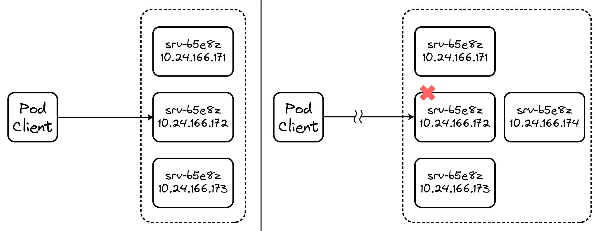
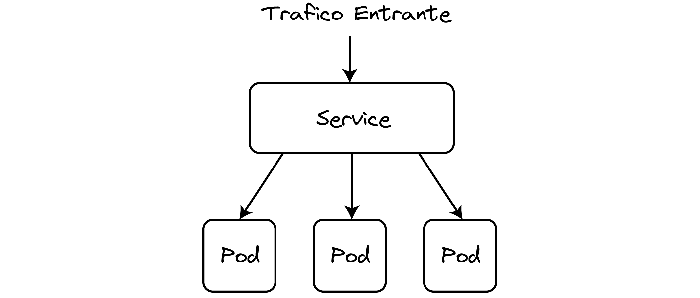
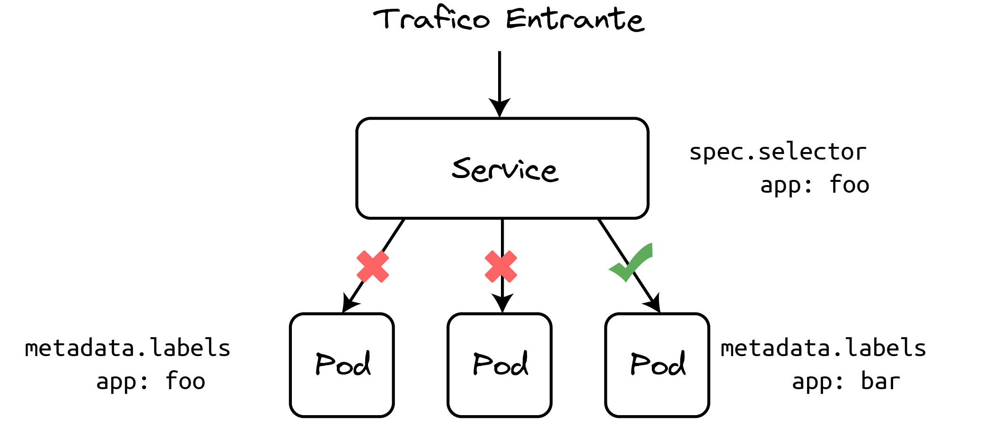
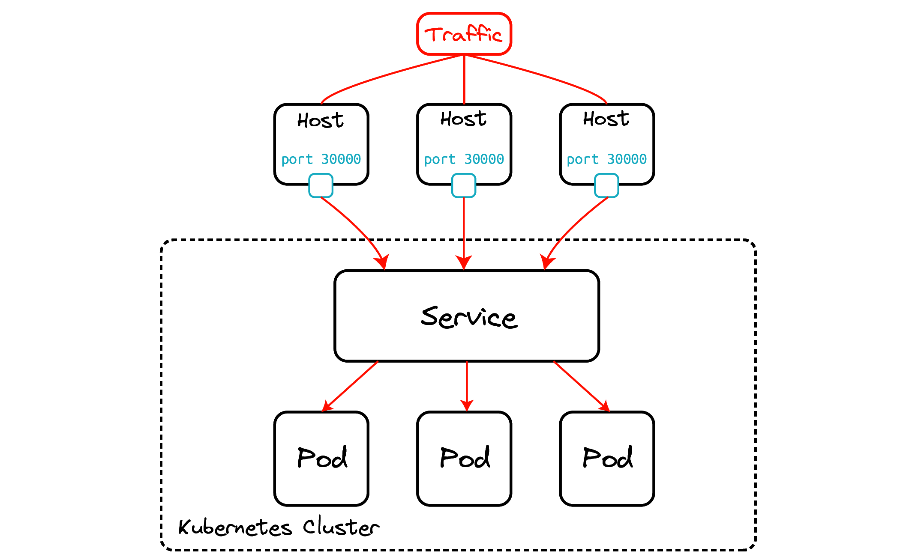
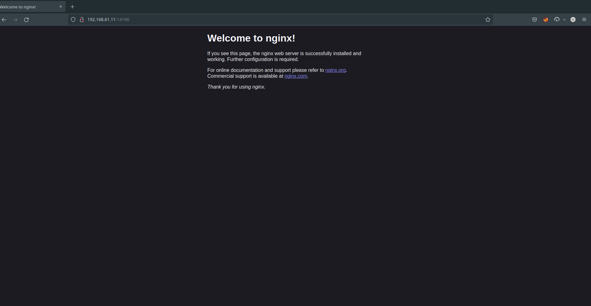
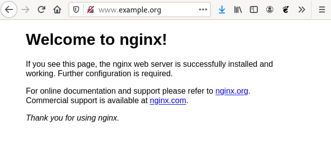

Supongamos el siguiente escenario, tengo un pod cliente que quiere hablar con uno de mis pods corriendo en el cluster. En este caso mi pod es un sitio web, además supongamos que por el alto volumen de tráfico tenemos varias replicas. ¿Cómo sabe el pod cliente como conectarse a uno de mis pods?

Sabemos que los pods pueden comunicarse entre ellos usando sus direcciones IP pero de nuevo, ¿cómo sabe el pod cliente como encontrarla y cuál usar?



Asumamos por un momento que tenemos algún mecánismo de resolución de nombres y obtenemos un pod al que conectarnos pero ¿que sucede si el pod escogido al azar se cae y perdemos la conexión? Es solo cuestión de tiempo que alguna mierda pase. El cliente tiene que conectarse de nuevo a otro pod. Esto parece senzillo pero no lo es especialmente en el contexto de Kubernetes en el que se generan y destruyen pods de manera constante. Las IPs de los pods son efimeras y los clientes no pueden "fiarse" de ellas. 

Vemos de manera lógica que necesitamos de algo intermedio entre nuestro pod cliente y los pods. Este algo que buscamos es el objeto `Service`. Un objeto `Service` nos da un único punto de acceso a un conjunto de pods a través de una IP Virtual estable y un nombre de DNS. Dicho de otra manera, cuando creamos un servicio obtenemos un nombre de DNS asociado al servicio mediante el cuál podemos encontrar nuestros pods y un único punto de acceso a través de su IP virtual y puerto.



([Services](https://kubernetes.io/docs/concepts/services-networking/service/))

## ¿Qué es un servicio?

Un servicio "expone" a un conjunto de pods:

+ Tiene una IP virtual estable y una dirección de dominio asociada.

+ La forma de asociar Pods a un `Service` es a través de las etiquetas.

+ Puerto y protocolo asociada a la IP virtual.

+ Se utiliza para la parte de autodescubrimiento mediante el DNS interno del cluster.



:::info
Si el Deployment que hemos creado tiene más de un Pod asociado, el Service que representa el acceso a esta aplicación **balanceará la carga** entre los Pods con una política Round Robin.
:::


:::info
Cuando tenemos más de un Pod ofreciendo el mismo servicio, realmente tenemos un clúster y es importante distinguir entre servicios sin estado (*stateless*) o con estado (*stateful*)). En un servicio sin estado (por ejemplo, un servidor web que sirva contenido estático), las peticiones son independientes y se pueden servir por diferentes nodos sin problema, aunque en el caso de un servidor web, deberíamos asegurarnos previamente de que el directorio con los datos es el mismo. Un servicio de este tipo lo podemos escalar con un despliegue sin problema. Por otra parte, si el servicio tiene estado (por ejemplo, un servidor de bases de datos), una petición puede depender de otra anterior, por lo que puede haber incoherencias si simplemente creamos un cluster de nodos iguales. En este tipo de servicios, es necesaria una configuración adicional que controle el estado y que haga que los datos que sirve cada Pod son coherentes entre sí. Veremos un ejemplo de este tipo de servicios en el módulo 9 del curso.
:::


:::info
En el cluster existirá un componente que nos ofrece un **servicio DNS**. Cada vez que creamos un Service se actualizará el DNS para resolver el nombre que hemos asignado al Service con la IP virtual (CLUSTER-IP) que se le ha asignado.
:::

## Tipos de Services

### ClusterIP

Solo se permite el acceso interno a un Service de este tipo. Es decir, si tenemos un despliegue con una aplicación a la que no es necesario acceder desde el exterior, crearemos un Service de este tipo para que otras aplicaciones puedan acceder a ella (por ejemplo, una base de datos). Es el tipo por defecto. Si deseamos seguir accediendo desde el exterior, para hacer pruebas durante la fase de desarrollo podemos seguir utilizando la instrucción `kubectl port-forward`.


### NodePort

Abre un puerto, para que el `Service` sea accesible desde el exterior. Por defecto el puerto generado está en el rango de 30000:40000. Para acceder usamos la ip del servidor master del cluster y el puerto asignado.



### LoadBalancer

Este tipo sólo está soportado en servicios de cloud público (GKE, AKS o AWS). El proveedor asignará un recurso de balanceo de carga para el acceso a los Services. Si usamos un cloud privado como OpenStack, necesitaremos un plugin para configurar el funcionamiento. Este tipo de Service no lo vamos a utilizar en el presente curso.

En este sección vamos a ver los siguientes puntos:

+ Cómo crear un servicio de tipo ClusterIP y NodePort
+ Como listar servicios y obtener información acerca de los mismos


:::warning Nota

Por defecto ejecutaremos todos los comandos dentro del namespace `curso-k8s`. Podemos setear de forma permanente siempre en el contexto de la sessión actual de la shell el namespace por defecto en el que se van a ejecutar todos los comandos de `kubectl` mediante:

```
$ kubectl config set-context --current --namespace curso-k8s
```

:::

## Crear un servicio tipo ClusterIP

Lo primero que vamos a hacer es deplegar un deployment de nginx usando el fichero yaml: [`nginx-deployment.yaml`](../modulo5/files/nginx-deployment.yaml):

    kubectl apply -f nginx-deployment.yaml

Por lo tanto tenemos dos Pods ofreciendo el servidor web nginx, a los que queremos acceder y poder balancear la carga. 

```bash
$ kubectl get deployments                   
NAME    READY   UP-TO-DATE   AVAILABLE   AGE
nginx   2/2     2
```

Como sabemos podemos crear objetos en kubernetes de manera imperativa o declarativa. Para un deployment que ya tenemos corriendo en el cluster podemos usar el comando `expose deployment` para exponer los pods que hay por debajo de ese deployment de la siguiente manera:

  ```bash
    $ kubectl expose deployment/nginx --port=80 --type=ClusterIP
  ```

:::info Nota

De hecho, existen dos maneras más de crear un `Service` de manera imperativa.

+ Usando el comando `create service` generamos un nuevo objeto en el cluster de tipo `Service`. Cuando usamos este comando es importante indicar el tipo de servicio que queremos usar y opcionalmente el mapeo de puertos. Por ahora no nos preocupamos del mapeo de puertos lo veremos más adelante.

  ```bash
  $ kubectl create service clusterip nginx-service --tcp=80:80
  ```

+ También podemos exponer un pod o un deployment con un único comando. El comando `run` proporciona la opción `--expose` el cuál nos permite crear un pod y su correspondiente `Service` con las etiquetas correctamente configuradas para balancear el tráfico 

  ```bash
  $ kubectl run nginx --image=nginx --restart=Never --port=80 --target-port=80
  ```
:::

En general lo que hacemos es usar el modelo declarativo y describir las características del Service en un fichero yaml [`nginx-srv.yaml`](files/nginx-srv.yaml):

```yaml
apiVersion: v1
kind: Service
metadata:
  name: nginx
spec:
  type: ClusterIP
  ports:
  - name: service-http
    port: 80
    targetPort: http
  selector:
    app: nginx
```

Vamos a describir lo que hemos hecho:

* Hemos creado un recurso de tipo `Service` (parámetro `kind`) y lo nombramos como `nginx` (parámetro `name`). Este nombre será importante para la resolución dns.
* En la especificación del recurso indicamos un servicio de tipo `ClusterIP` (parámetro `type`).
* A continuación, definimos el puerto por el que va a ofrecer el Service y lo nombramos (dentro del apartado `port`: el parámetro `port` y el parámetro `name`). Además, debemos indicar el puerto en el que los Pods están ofreciendo el Service (parámetro `targetPort`), en este caso, hemos usado el nombre del puerto (`http`) que indicamos en el recurso Deployment:

  ```yaml
     ...
     ports:
      - name: http
        containerPort: 80
     ...
  ```
* Por ultimo, seleccionamos los Pods a los que vamos acceder y vamos a balancear la carga seleccionando los Pods por medio de sus etiquetas (parámetro `selector`).

Utilizamos el comando `apply` para poner en funcionamiento el ejemplo anterior

```bash
$ kubectl apply -f nginx-srv.yaml
```

## Examinando los servicios creados

### Listar Servicios

Podemos listar los servicios que tenemos con el siguiente comando:

```bash
$ kubectl get services                        
NAME         TYPE        CLUSTER-IP   EXTERNAL-IP   PORT(S)   AGE
nginx        ClusterIP   10.43.1.37   <none>        80/TCP    3m36s 
```

La salida del comando nos indica el tipo de servicio, la IP virtual asociada y los puertos mapeados. 

:::info Recordar
La IP asociada a un servicio de tipo `ClusterIP` es solamente accesible desde dentro del cluster.
:::

### Obtener información detallada del servicio

El comando `describe` nos permite obtener más información del servicio creado.

```bash
$ kubectl describe svc nginx                   
Name:              nginx
Namespace:         default
Labels:            app=nginx
Annotations:       <none>
Selector:          app=nginx
Type:              ClusterIP
IP Family Policy:  SingleStack
IP Families:       IPv4
IP:                10.43.1.37
IPs:               10.43.1.37
Port:              <unset>  80/TCP
TargetPort:        80/TCP
Endpoints:         10.42.0.6:80,10.42.2.6:80
Session Affinity:  None
Events:            <none>
```

### Testeando el servicio desde dentro del cluster

Podemos enviar peticiones desde dentro del cluster de diferentes formas:

+ Crear un pod que envie peticiones a la IP de servicio y examinar los logs de salida.

+ Conectarnos por ssh a uno de los nodos del cluster y utilizar el comando `curl`

+ Crear un pod temporal que disponga del comando curl y ejecutarlo desde dentro o bien usando el comando `kubectl exec`

Vamos a ver la última opción y así veremos como ejecutar comandos en pods que tenemos corriendo en el cluster.

## Crear un servicio de tipo NodePort

Para aprender cómo gestionamos los Services, vamos a trabajar con el Deployment de nginx ([`nginx-deployment.yaml`](../modulo5/files/nginx-deployment.yaml)) y el Service NodePort ([`nginx-srv.yaml`](files/nginx-srv.yaml)) para acceder a los Pods de este despliegue desde el exterior.

### Creamos el Deployment

El primer paso sería crear el Deployment de nginx:

    kubectl apply -f nginx-deployment.yaml

### Creamos el Service

A continuación vamos a crear el Service de tipo NodePort que nos permitirá acceder al servidor nginx.

    kubectl apply -f nginx-srv.yaml

Para ver los Services que tenemos creado:

    kubectl get services

Recuerda que si usamos `kubectl get all` también se mostrarán los Services.

Antes de acceder a la aplicación podemos ver la información más detallada del Service que acabamos de crear:

    kubectl describe service/nginx
    Name:                     nginx
    ...
    Selector:                 app=nginx
    Type:                     NodePort
    ...
    IP:                       10.110.81.74
    Port:                     service-http  80/TCP
    TargetPort:               http/TCP
    NodePort:                 service-http  32717/TCP
    Endpoints:                172.17.0.3:80,172.17.0.4:80
    ...

Podemos ver la etiqueta de los Pods a los que accede (`Selector`). El tipo de Service (`Type`). La IP virtual que ha tomado (CLUSTER-IP) y que es accesible desde el cluster (`IP`). El puerto por el que ofrece el Service (`Port`). El puerto de los Pods a los que redirige el tráfico (`TargetPort`). Al ser un service de tipo NodePort nos da información del puerto que se asignado para acceder a la aplicación (`NodePort`). Y por último, podemos ver las IPs de los Pods que ha seleccionado y sobre los que balanceará la carga (`Endpoints`).

### Accediendo a la aplicación

Vemos el Service que hemos creado:

    kubectl get services
    ...
    nginx        NodePort    10.110.81.74   <none>        80:32717/TCP   32s

Observamos que se ha asignado el puerto 32717 para el acceso, por lo tanto si desde un navegador accedemos a la IP del nodo master y a este puerto podremos ver la aplicación.

Las IPs de los nodos son las siguientes:

```
  host01 ip => "192.168.61.11"
  host02 ip => "192.168.61.12"
  host03 ip => "192.168.61.13"
```

Y ya podemos acceder desde un navegador web:




## Laboratorio

:::tip Ejercicios

1. Crear un servicio de tipo `ClusterIP` para un despliegue de MariaDB. Podeis usar como referencia el siguiente fichero [`mariadb-deployment.yaml`](files/mariadb-deployment.yaml)

  <details>
    <summary>Ver Solución</summary>
  
  En esta ocasión vamos a desplegar una base de datos MariaDB. En este caso no vamos a necesitar acceder a la base de datos desde el exterior, pero necesitamos que los Pods de otro despliegue puedan acceder a ella. Por lo tanto vamos a crear un Service de tipo ClusterIP.
  
  Para el despliegue de MariaDB vamos a usar el fichero [`mariadb-deployment.yaml`](files/mariadb-deployment.yaml). Puedes comprobar que en la definición del contenedor hemos añadido la sección `env` que nos permite establecer variables de entorno para configurar el contenedor (los estudiaremos en el siguiente módulo).
  
  Para la creación del Service utilizamos el fichero [`mariadb-srv.yaml`](files/mariadb-srv.yaml).
  
  Para la creación del Deployment y el Service vamos ejecutando las siguientes instrucciones:
  
      kubectl apply -f mariadb-deployment.yaml
      kubectl apply -f mariadb-srv.yaml
  
  Comprobamos el Service creado:
  
      kubectl get services
      mariadb      ClusterIP   10.106.60.233   <none>        3306/TCP       2m22s
  
      kubectl describe service/mariadb
      Name:              mariadb
      ...
      Selector:          app=mariadb
      Type:              ClusterIP
      ...
      IP:                10.106.60.233
      Port:              service-bd  3306/TCP
      TargetPort:        db-port/TCP
      Endpoints:         172.17.0.5:3306
      ...
  
  Podemos comprobar que no se ha mapeado un puerto aleatorio para que accedamos usando la IP del nodo master. Los Pods que accedan a la IP 10.106.60.233 o al nombre `mariadb` y al puerto 3306 estarán accediendo al Pod (172.17.0.5:3306) del despliegue de mariadb.
  
  ## Eliminando los servicios
  
  Por ejemplo para borrar el servicio `mariadb`, ejecutaríamos:
  
      kubectl delete service mariadb  
  
  </details>
:::


## ¿Qué es lo que realmente esta sucediendo?


En los nodos dónde se ejecutan los pods corre un proxy el cuál intercepta el tráfico, por defecto este componente es conocido como "kube-proxy". En realidad este componente no es un proxy en si mismo sino que convierte a los nodos en un proxy. Para conseguir que los nodos funcionen como un proxy se usan funcionalidades del kernel de linux como IPTables o IPVS segun el modo en que este funcionando y esto depende de cómo se haya instalado o de la distribución usada de k8s.


El cliente empieza por realizar una petición DNS, el servicio DNS de k8s devuelve la VIP del servicio que intentamos resolver. Una vez obtenida la VIP el cliente se conecta a ella el proxy intercepta el tráfico y redirige el tráfico al pod destino.


Ahora bien el servicio es una entidad virtual ¿cómo sabe el proxy a que pods mandar el tráfico?. Cómo la mayoria de cosas en kubernetes esto es posible gracias a un controlador. Esencialmente este controlador cogera la lista de pods asociados al servicio gracias a los selectores de etiquetas y lo reducira a una lista de endpoints. En general esta lista de endpoints sera una lista de IPs y en general seran pods pero no tiene porqué. La API que implementa el objeto endpoints tiene entre otras funcionalidades la capacidad de poder aceptar IPs de otras fuentes pero esto es otra historia.

```
root@host01: iptables-save | grep 'default/nginx:service-http'
-A KUBE-NODEPORTS -p tcp -m comment --comment "default/nginx:service-http" -m tcp --dport 14166 -j KUBE-SVC-J3IQXGWMHP6USLHH
-A KUBE-SEP-IJVV3SZXXOZTXYR4 -s 172.31.25.202/32 -m comment --comment "default/nginx:service-http" -j KUBE-MARK-MASQ
-A KUBE-SEP-IJVV3SZXXOZTXYR4 -p tcp -m comment --comment "default/nginx:service-http" -m tcp -j DNAT --to-destination 172.31.25.202:80
-A KUBE-SEP-P7TMJ4U5XB3DQ5CE -s 172.31.89.212/32 -m comment --comment "default/nginx:service-http" -j KUBE-MARK-MASQ
-A KUBE-SEP-P7TMJ4U5XB3DQ5CE -p tcp -m comment --comment "default/nginx:service-http" -m tcp -j DNAT --to-destination 172.31.89.212:80
-A KUBE-SERVICES -d 10.101.5.101/32 -p tcp -m comment --comment "default/nginx:service-http cluster IP" -m tcp --dport 80 -j KUBE-SVC-J3IQXGWMHP6USLHH
-A KUBE-SVC-J3IQXGWMHP6USLHH ! -s 172.31.0.0/16 -d 10.101.5.101/32 -p tcp -m comment --comment "default/nginx:service-http cluster IP" -m tcp --dport 80 -j KUBE-MARK-MASQ
-A KUBE-SVC-J3IQXGWMHP6USLHH -p tcp -m comment --comment "default/nginx:service-http" -m tcp --dport 14166 -j KUBE-MARK-MASQ
-A KUBE-SVC-J3IQXGWMHP6USLHH -m comment --comment "default/nginx:service-http" -m statistic --mode random --probability 0.50000000000 -j KUBE-SEP-IJVV3SZXXOZTXYR4
-A KUBE-SVC-J3IQXGWMHP6USLHH -m comment --comment "default/nginx:service-http" -j KUBE-SEP-P7TMJ4U5XB3DQ5CE
```

# Servicio DNS en Kubernetes

Existe un componente de Kubernetes llamado CoreDNS, que ofrece un servidor DNS interno para que los Pods puedan resolver diferentes nombres de recursos (Services, Pods, ...) a direcciones IP.

Cada vez que se crea un nuevo recurso Service se crea un registro de tipo A con el nombre:

    <nombre_servicio>.<nombre_namespace>.svc.cluster.local.

## Comprobemos el servidor DNS

Partimos del punto anterior donde tenemos creados los dos Services:

    kubectl get services
    mariadb      ClusterIP   10.106.60.233   <none>        3306/TCP
    nginx        NodePort    10.110.81.74    <none>        80:32717/TCP

Para comprobar el servidor DNS de nuestro cluster y que podemos resolver los nombres de los distintos Services, vamos a usar un Pod ([`busybox.yaml`](files/busybox.yaml)) creado desde una imagen `busybox`.  Es una imagen muy pequeña pero con algunas utilidades que nos vienen muy bien:

    kubectl apply -f busybox.yaml

¿Qué servidor DNS está configurado en los Pods que estamos creando? Podemos ejecutar la siguiente instrucción para comprobarlo:

    kubectl exec -it busybox -- cat /etc/resolv.conf
    nameserver 10.96.0.10
    search default.svc.cluster.local svc.cluster.local cluster.local

* El servidor DNS (componente coreDNS) tiene asignado la IP del cluster 10.96.0.10.
* Podemos utilizar el nombre corto del Service, porque buscará el nombre del host totalmente cualificado usando los dominios indicados en el parámetro `search`. Como vemos el primer nombre de dominio es el que se crea con los Services: `default.svc.cluster.local` (recuerda que el *namespace* que estamos usando es `default`).

Vamos a comprobar que realmente se han creado dos registros A para cada uno de los Service, haciendo consultas DNS:

    kubectl exec -it busybox -- nslookup nginx
    Server:		10.96.0.10
    Address:	10.96.0.10:53

    Name:	nginx.default.svc.cluster.local
    Address: 10.110.81.74

Vemos que ha hecho la resolución del nombre `nginx` con la IP correspondiente a su servicio. Y con el Service mariadb también lo podemos hacer:

    kubectl exec -it busybox -- nslookup mariadb
    Server:		10.96.0.10
    Address:	10.96.0.10:53

    Name:	mariadb.default.svc.cluster.local
    Address: 10.106.60.233

También podemos comprobar que usando el nombre podemos acceder al servicio:

    kubectl exec -it busybox -- wget http://nginx
    Connecting to nginx (10.110.81.74:80)
    saving to 'index.html'
    ...

Podemos concluir que, cuando necesitemos acceder desde alguna aplicación desplegada en nuestro cluster a otro servicio ofrecido por otro despliegue, **utilizaremos el nombre que hemos asignado a su Service de acceso**. Por ejemplo, si desplegamos un Wordpress y un servidor de base de datos mariadb, y creamos dos Services: uno de tipo NodePort para acceder desde el exterior al CMS, y otro, que llamamos `mariadb` de tipo ClusterIP para acceder ala base de datos, cuando tengamos que configurar el Wordpress para indicar la dirección de la base de datos, pondremos `mariadb`.


# Ingress Controller

Hasta ahora tenemos dos opciones principales para acceder a nuestras aplicaciones desde el exterior:

1. Utilizando Services del tipo NodePort: Esta opción no es muy viable para entornos de producción ya que tenemos que utilizar puertos aleatorios desde 30000-40000.
2. Utilizando Services del tipo LoadBalancer: Esta opción sólo es válida si trabajamos en un proveedor Cloud que nos ofrece un balanceador de carga para cada una de las aplicaciones, en cloud público puede ser una opción muy cara.

La solución puede ser utilizar un [Ingress controller](https://kubernetes.io/docs/concepts/services-networking/ingress/) que nos permite utilizar un proxy inverso (HAproxy, nginx, traefik,...) que por medio de reglas de encaminamiento que obtiene de la API de Kubernetes, nos permite el acceso a nuestras aplicaciones por medio de nombres.


## Instalación de Ingress Controller en minikube

Cuando hacemos una instalación de minikube el componente de Ingress Controller no viene instalada por defecto. minikube nos ofrece un conjunto de *addons* que al activarlos nos instalan un determinado componente que nos ofrece una funcionalidad adicional. Para ver los *addons* que nos ofrece minikube podemos ejecutar:

    minikube addons list

Para activar el Ingress Controller ejecutamos:

    minikube addons enable ingress

Para comprobar si tenemos instalado el componente, podemos visualizar los Pods creados en el *namespace* `ingress-nginx`. Este espacio de nombre se ha creado para desplegar el controlador de ingress Por lo tanto al ejecutar:

    kubectl get pods -n ingress-nginx 
    ...
    ingress-nginx-controller-558664778f-shjzp   1/1     Running     0          
    ...    

Debe aparece un Pod que se llama `ingress-nginx-controller-...`, si es así, significa que se ha instalado un Ingress Controller basado en el proxy inverso nginx.

## Describiendo el recurso Ingress

Una vez instalado el componente Ingress Controller, ya podemos definir un recurso Ingress en un fichero yaml. Para ello vamos a trabajar con el despliegue y el Service que hemos creado de nginx.

El recurso Ingress para acceder a nuestro despliegue de nginx lo tenemos en el fichero [`ingress.yaml`](file/ingress.yaml):

```yaml
apiVersion: networking.k8s.io/v1
kind: Ingress
metadata:
  name: nginx
spec:
  rules:
  - host: www.example.org
    http:
      paths:
      - path: /
        pathType: Prefix
        backend:
          service:
            name: nginx
            port:
              number: 80
```

Hemos indicado el tipo de recurso Ingress (`kind`) y le hemos puesto un nombre (`name`). A continuación en la especificación del recurso vamos a poner una regla que relaciona un nombre de host con un Service que me permita el acceso a una aplicación:

* `host`: Indicamos el nombre de host que vamos a usar para el acceso. Este nombre debe apuntar a la ip del nodo master.
* `path`: Indicamos el path de la url que vamos a usar, en este caso sería la ruta raíz: `/`. Esto nos sirve por si queremos servir la aplicación en una ruta determinada, por ejemplo: `www.example.org/app1`.
* `pathType`: No es importante, nos permite indicar cómo se van a trabajar con las URL. 
* `backend`: Indicamos el Service al que vamos a acceder. En este caso indicamos el nombre del Service (`service/name`) y el puerto del Service (`service/port/number`).

Cuando se crea el recurso, y accedamos al nombre indicado, un proxy inverso redirigirá las peticiones HTTP a la IP y al puerto del Service correspondiente. **Nota: Utilizando Ingress no es necesario que los Services sean de tipo NodePort para acceder a la aplicación desde el exterior**.

## Gestionando el recurso Ingress

Para crear el recurso Ingress:

    kubectl apply -f ingress.yaml

Y podemos ver el recurso Ingress que hemos creado:

    kubectl get ingress

Y obtener información detallada del recurso con:

    kubectl describe ingress/nginx

## Accediendo a la aplicación

Como no tenemos un servidor DNS que nos permita gestionar los nombres que vamos a utilizar para el acceso a las aplicaciones, vamos a usar resolución estática. Para ello como `root` añadimos una nueva línea en el fichero `/etc/hosts`, indicando el nombre (`www.example.org`) y la ip a la que corresponde, la ip del nodo master:

    192.168.39.222  www.example.org

Y ya podemos acceder a la aplicación usando el nombre:



## Vídeo

[https://www.youtube.com/watch?v=X2dW9UbfU88](https://www.youtube.com/watch?v=X2dW9UbfU88)
