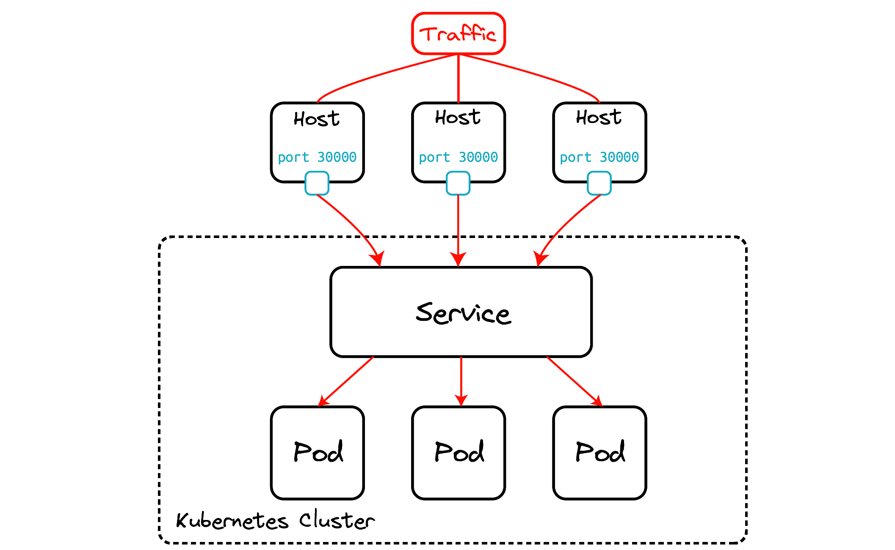

Supongamos el siguiente escenario, tengo un pod cliente que quiere hablar con uno de mis pods corriendo en el cluster. En este caso mi pod es un sitio web, además supongamos que por el alto volumen de tráfico tenemos varias replicas. ¿Cómo sabe el pod cliente como conectarse a uno de mis pods?

Sabemos que los pods pueden comunicarse entre ellos usando sus direcciones IP pero de nuevo, ¿cómo sabe el pod cliente como encontrarla y cuál usar?

Asumamos por un momento que tenemos algún mecánismo de resolución de nombres y obtenemos un pod al que conectarnos pero ¿que sucede si el pod escogido al azar se cae y perdemos la conexión? Es solo cuestión de tiempo que alguna mierda pase. El cliente tiene que conectarse de nuevo a otro pod. Esto parece senzillo pero no lo es especialmente en el contexto de Kubernetes en el que se generan y destruyen pods de manera constante. Las IPs de los pods son efimeras y los clientes no pueden "fiarse" de ellas. 

Vemos de manera lógica que necesitamos de algo intermedio entre nuestro pod cliente y los pods. Este algo que buscamos es el objeto `Service`. Un objeto `Service` nos da un único punto de acceso a un conjunto de pods a través de una IP Virtual estable y un nombre de DNS. Dicho de otra manera, cuando creamos un servicio obtenemos un nombre de DNS asociado al servicio mediante el cuál podemos encontrar nuestros pods y un único punto de acceso a través de su IP virtual y puerto.

([Services](https://kubernetes.io/docs/concepts/services-networking/service/))

## ¿Qué es un servicio?

Un servicio "expone" a un conjunto de pods:

+ Tiene una IP virtual estable y una dirección de dominio asociada.

+ La forma de asociar Pods a un `Service` es a través de las etiquetas.

+ Puerto y protocolo asociada a la IP virtual.

+ Se utiliza para la parte de autodescubrimiento mediante el DNS interno del cluster.

:::info
Si el Deployment que hemos creado tiene más de un Pod asociado, el Service que representa el acceso a esta aplicación **balanceará la carga** entre los Pods con una política Round Robin.
:::

:::info
Cuando tenemos más de un Pod ofreciendo el mismo servicio, realmente tenemos un clúster y es importante distinguir entre servicios sin estado (*stateless*) o con estado (*stateful*)). En un servicio sin estado (por ejemplo, un servidor web que sirva contenido estático), las peticiones son independientes y se pueden servir por diferentes nodos sin problema, aunque en el caso de un servidor web, deberíamos asegurarnos previamente de que el directorio con los datos es el mismo. Un servicio de este tipo lo podemos escalar con un despliegue sin problema. Por otra parte, si el servicio tiene estado (por ejemplo, un servidor de bases de datos), una petición puede depender de otra anterior, por lo que puede haber incoherencias si simplemente creamos un cluster de nodos iguales. En este tipo de servicios, es necesaria una configuración adicional que controle el estado y que haga que los datos que sirve cada Pod son coherentes entre sí. Veremos un ejemplo de este tipo de servicios en el módulo 9 del curso.
:::

:::info
En el cluster existirá un componente que nos ofrece un **servicio DNS**. Cada vez que creamos un Service se actualizará el DNS para resolver el nombre que hemos asignado al Service con la IP virtual (CLUSTER-IP) que se le ha asignado.
:::

## Tipos de Services

### ClusterIP

Solo se permite el acceso interno a un Service de este tipo. Es decir, si tenemos un despliegue con una aplicación a la que no es necesario acceder desde el exterior, crearemos un Service de este tipo para que otras aplicaciones puedan acceder a ella (por ejemplo, una base de datos). Es el tipo por defecto. Si deseamos seguir accediendo desde el exterior, para hacer pruebas durante la fase de desarrollo podemos seguir utilizando la instrucción `kubectl port-forward`.

### NodePort

Abre un puerto, para que el `Service` sea accesible desde el exterior. Por defecto el puerto generado está en el rango de 30000:40000. Para acceder usamos la ip del servidor master del cluster y el puerto asignado.

### LoadBalancer

Este tipo sólo está soportado en servicios de cloud público (GKE, AKS o AWS). El proveedor asignará un recurso de balanceo de carga para el acceso a los Services. Si usamos un cloud privado como OpenStack, necesitaremos un plugin para configurar el funcionamiento. Este tipo de Service no lo vamos a utilizar en el presente curso.