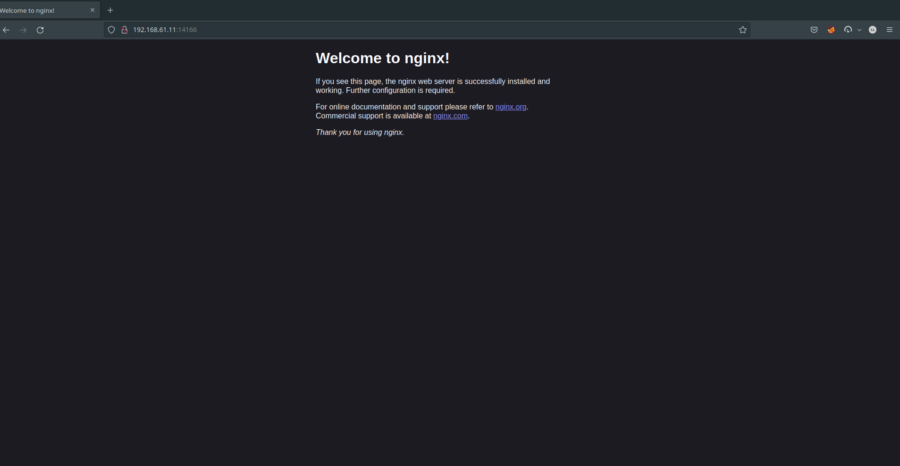

En este sección vamos a ver los siguientes puntos:

+ Cómo crear un servicio de tipo ClusterIP y NodePort
+ Como listar servicios y obtener información acerca de los mismos


:::warning Nota

Por defecto ejecutaremos todos los comandos dentro del namespace `curso-k8s`. Podemos setear de forma permanente siempre en el contexto de la sessión actual de la shell el namespace por defecto en el que se van a ejecutar todos los comandos de `kubectl` mediante:

```
$ kubectl config set-context --current --namespace curso-k8s
```

:::

## Crear un servicio tipo ClusterIP

Lo primero que vamos a hacer es deplegar un deployment de nginx usando el fichero yaml: [`nginx-deployment.yaml`](../modulo5/files/nginx-deployment.yaml):

    kubectl apply -f nginx-deployment.yaml

Por lo tanto tenemos dos Pods ofreciendo el servidor web nginx, a los que queremos acceder y poder balancear la carga. 

```bash
$ kubectl get deployments                   
NAME    READY   UP-TO-DATE   AVAILABLE   AGE
nginx   2/2     2
```

Como sabemos podemos crear objetos en kubernetes de manera imperativa o declarativa. Para un deployment que ya tenemos corriendo en el cluster podemos usar el comando `expose deployment` para exponer los pods que hay por debajo de ese deployment de la siguiente manera:

  ```bash
    $ kubectl expose deployment/nginx --port=80 --type=ClusterIP
  ```

:::info Nota

De hecho, existen dos maneras más de crear un `Service` de manera imperativa.

+ Usando el comando `create service` generamos un nuevo objeto en el cluster de tipo `Service`. Cuando usamos este comando es importante indicar el tipo de servicio que queremos usar y opcionalmente el mapeo de puertos. Por ahora no nos preocupamos del mapeo de puertos lo veremos más adelante.

  ```bash
  $ kubectl create service clusterip nginx-service --tcp=80:80
  ```

+ También podemos exponer un pod o un deployment con un único comando. El comando `run` proporciona la opción `--expose` el cuál nos permite crear un pod y su correspondiente `Service` con las etiquetas correctamente configuradas para balancear el tráfico 

  ```bash
  $ kubectl run nginx --image=nginx --restart=Never --port=80 --target-port=80
  ```
:::

En general lo que hacemos es usar el modelo declarativo y describir las características del Service en un fichero yaml [`nginx-srv.yaml`](files/nginx-srv.yaml):

```yaml
apiVersion: v1
kind: Service
metadata:
  name: nginx
spec:
  type: ClusterIP
  ports:
  - name: service-http
    port: 80
    targetPort: http
  selector:
    app: nginx
```

Vamos a describir lo que hemos hecho:

* Hemos creado un recurso de tipo `Service` (parámetro `kind`) y lo nombramos como `nginx` (parámetro `name`). Este nombre será importante para la resolución dns.
* En la especificación del recurso indicamos un servicio de tipo `ClusterIP` (parámetro `type`).
* A continuación, definimos el puerto por el que va a ofrecer el Service y lo nombramos (dentro del apartado `port`: el parámetro `port` y el parámetro `name`). Además, debemos indicar el puerto en el que los Pods están ofreciendo el Service (parámetro `targetPort`), en este caso, hemos usado el nombre del puerto (`http`) que indicamos en el recurso Deployment:

  ```yaml
     ...
     ports:
      - name: http
        containerPort: 80
     ...
  ```
* Por ultimo, seleccionamos los Pods a los que vamos acceder y vamos a balancear la carga seleccionando los Pods por medio de sus etiquetas (parámetro `selector`).

Utilizamos el comando `apply` para poner en funcionamiento el ejemplo anterior

```bash
$ kubectl apply -f nginx-srv.yaml
```

## Examinando los servicios creados

### Listar Servicios

Podemos listar los servicios que tenemos con el siguiente comando:

```bash
$ kubectl get services                        
NAME         TYPE        CLUSTER-IP   EXTERNAL-IP   PORT(S)   AGE
nginx        ClusterIP   10.43.1.37   <none>        80/TCP    3m36s 
```

La salida del comando nos indica el tipo de servicio, la IP virtual asociada y los puertos mapeados. 

:::info Recordar
La IP asociada a un servicio de tipo `ClusterIP` es solamente accesible desde dentro del cluster.
:::

### Obtener información detallada del servicio

El comando `describe` nos permite obtener más información del servicio creado.

```bash
$ kubectl describe svc nginx                   
Name:              nginx
Namespace:         default
Labels:            app=nginx
Annotations:       <none>
Selector:          app=nginx
Type:              ClusterIP
IP Family Policy:  SingleStack
IP Families:       IPv4
IP:                10.43.1.37
IPs:               10.43.1.37
Port:              <unset>  80/TCP
TargetPort:        80/TCP
Endpoints:         10.42.0.6:80,10.42.2.6:80
Session Affinity:  None
Events:            <none>
```

### Testeando el servicio desde dentro del cluster

Podemos enviar peticiones desde dentro del cluster de diferentes formas:

+ Crear un pod que envie peticiones a la IP de servicio y examinar los logs de salida.

+ Conectarnos por ssh a uno de los nodos del cluster y utilizar el comando `curl`

+ Crear un pod temporal que disponga del comando curl y ejecutarlo desde dentro o bien usando el comando `kubectl exec`

Vamos a ver la última opción y así veremos como ejecutar comandos en pods que tenemos corriendo en el cluster.

## Crear un servicio de tipo NodePort

Para aprender cómo gestionamos los Services, vamos a trabajar con el Deployment de nginx ([`nginx-deployment.yaml`](../modulo5/files/nginx-deployment.yaml)) y el Service NodePort ([`nginx-srv.yaml`](files/nginx-srv.yaml)) para acceder a los Pods de este despliegue desde el exterior.

### Creamos el Deployment

El primer paso sería crear el Deployment de nginx:

    kubectl apply -f nginx-deployment.yaml

### Creamos el Service

A continuación vamos a crear el Service de tipo NodePort que nos permitirá acceder al servidor nginx.

    kubectl apply -f nginx-srv.yaml

Para ver los Services que tenemos creado:

    kubectl get services

Recuerda que si usamos `kubectl get all` también se mostrarán los Services.

Antes de acceder a la aplicación podemos ver la información más detallada del Service que acabamos de crear:

    kubectl describe service/nginx
    Name:                     nginx
    ...
    Selector:                 app=nginx
    Type:                     NodePort
    ...
    IP:                       10.110.81.74
    Port:                     service-http  80/TCP
    TargetPort:               http/TCP
    NodePort:                 service-http  32717/TCP
    Endpoints:                172.17.0.3:80,172.17.0.4:80
    ...

Podemos ver la etiqueta de los Pods a los que accede (`Selector`). El tipo de Service (`Type`). La IP virtual que ha tomado (CLUSTER-IP) y que es accesible desde el cluster (`IP`). El puerto por el que ofrece el Service (`Port`). El puerto de los Pods a los que redirige el tráfico (`TargetPort`). Al ser un service de tipo NodePort nos da información del puerto que se asignado para acceder a la aplicación (`NodePort`). Y por último, podemos ver las IPs de los Pods que ha seleccionado y sobre los que balanceará la carga (`Endpoints`).

### Accediendo a la aplicación

Vemos el Service que hemos creado:

    kubectl get services
    ...
    nginx        NodePort    10.110.81.74   <none>        80:32717/TCP   32s

Observamos que se ha asignado el puerto 32717 para el acceso, por lo tanto si desde un navegador accedemos a la IP del nodo master y a este puerto podremos ver la aplicación.

Las IPs de los nodos son las siguientes:

```
  host01 ip => "192.168.61.11"
  host02 ip => "192.168.61.12"
  host03 ip => "192.168.61.13"
```

Y ya podemos acceder desde un navegador web:




## Laboratorio

:::tip Ejercicios

1. Crear un servicio de tipo `ClusterIP` para un despliegue de MariaDB. Podeis usar como referencia el siguiente fichero [`mariadb-deployment.yaml`](files/mariadb-deployment.yaml)

  <details>
    <summary>Ver Solución</summary>
  
  En esta ocasión vamos a desplegar una base de datos MariaDB. En este caso no vamos a necesitar acceder a la base de datos desde el exterior, pero necesitamos que los Pods de otro despliegue puedan acceder a ella. Por lo tanto vamos a crear un Service de tipo ClusterIP.
  
  Para el despliegue de MariaDB vamos a usar el fichero [`mariadb-deployment.yaml`](files/mariadb-deployment.yaml). Puedes comprobar que en la definición del contenedor hemos añadido la sección `env` que nos permite establecer variables de entorno para configurar el contenedor (los estudiaremos en el siguiente módulo).
  
  Para la creación del Service utilizamos el fichero [`mariadb-srv.yaml`](files/mariadb-srv.yaml).
  
  Para la creación del Deployment y el Service vamos ejecutando las siguientes instrucciones:
  
      kubectl apply -f mariadb-deployment.yaml
      kubectl apply -f mariadb-srv.yaml
  
  Comprobamos el Service creado:
  
      kubectl get services
      mariadb      ClusterIP   10.106.60.233   <none>        3306/TCP       2m22s
  
      kubectl describe service/mariadb
      Name:              mariadb
      ...
      Selector:          app=mariadb
      Type:              ClusterIP
      ...
      IP:                10.106.60.233
      Port:              service-bd  3306/TCP
      TargetPort:        db-port/TCP
      Endpoints:         172.17.0.5:3306
      ...
  
  Podemos comprobar que no se ha mapeado un puerto aleatorio para que accedamos usando la IP del nodo master. Los Pods que accedan a la IP 10.106.60.233 o al nombre `mariadb` y al puerto 3306 estarán accediendo al Pod (172.17.0.5:3306) del despliegue de mariadb.
  
  ## Eliminando los servicios
  
  Por ejemplo para borrar el servicio `mariadb`, ejecutaríamos:
  
      kubectl delete service mariadb  
  
  </details>
:::
