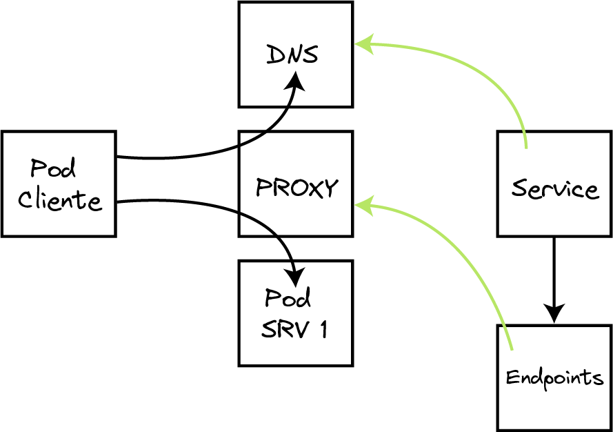

## ¿Qué es lo que realmente esta sucediendo?


En los nodos dónde se ejecutan los pods corre un proxy el cuál intercepta el tráfico, por defecto este componente es conocido como "kube-proxy". En realidad este componente no es un proxy en si mismo sino que convierte a los nodos en un proxy. Para conseguir que los nodos funcionen como un proxy se usan funcionalidades del kernel de linux como IPTables o IPVS segun el modo en que este funcionando y esto depende de cómo se haya instalado o de la distribución usada de k8s.


El cliente empieza por realizar una petición DNS, el servicio DNS de k8s devuelve la VIP del servicio que intentamos resolver. Una vez obtenida la VIP el cliente se conecta a ella el proxy intercepta el tráfico y redirige el tráfico al pod destino.




Ahora bien el servicio es una entidad virtual ¿cómo sabe el proxy a que pods mandar el tráfico?. Cómo la mayoria de cosas en kubernetes esto es posible gracias a un controlador. Esencialmente este controlador cogera la lista de pods asociados al servicio gracias a los selectores de etiquetas y lo reducira a una lista de endpoints. En general esta lista de endpoints sera una lista de IPs y en general seran pods pero no tiene porqué. La API que implementa el objeto endpoints tiene entre otras funcionalidades la capacidad de poder aceptar IPs de otras fuentes pero esto es otra historia.

```
root@host01: iptables-save | grep 'default/nginx:service-http'
-A KUBE-NODEPORTS -p tcp -m comment --comment "default/nginx:service-http" -m tcp --dport 14166 -j KUBE-SVC-J3IQXGWMHP6USLHH
-A KUBE-SEP-IJVV3SZXXOZTXYR4 -s 172.31.25.202/32 -m comment --comment "default/nginx:service-http" -j KUBE-MARK-MASQ
-A KUBE-SEP-IJVV3SZXXOZTXYR4 -p tcp -m comment --comment "default/nginx:service-http" -m tcp -j DNAT --to-destination 172.31.25.202:80
-A KUBE-SEP-P7TMJ4U5XB3DQ5CE -s 172.31.89.212/32 -m comment --comment "default/nginx:service-http" -j KUBE-MARK-MASQ
-A KUBE-SEP-P7TMJ4U5XB3DQ5CE -p tcp -m comment --comment "default/nginx:service-http" -m tcp -j DNAT --to-destination 172.31.89.212:80
-A KUBE-SERVICES -d 10.101.5.101/32 -p tcp -m comment --comment "default/nginx:service-http cluster IP" -m tcp --dport 80 -j KUBE-SVC-J3IQXGWMHP6USLHH
-A KUBE-SVC-J3IQXGWMHP6USLHH ! -s 172.31.0.0/16 -d 10.101.5.101/32 -p tcp -m comment --comment "default/nginx:service-http cluster IP" -m tcp --dport 80 -j KUBE-MARK-MASQ
-A KUBE-SVC-J3IQXGWMHP6USLHH -p tcp -m comment --comment "default/nginx:service-http" -m tcp --dport 14166 -j KUBE-MARK-MASQ
-A KUBE-SVC-J3IQXGWMHP6USLHH -m comment --comment "default/nginx:service-http" -m statistic --mode random --probability 0.50000000000 -j KUBE-SEP-IJVV3SZXXOZTXYR4
-A KUBE-SVC-J3IQXGWMHP6USLHH -m comment --comment "default/nginx:service-http" -j KUBE-SEP-P7TMJ4U5XB3DQ5CE
```